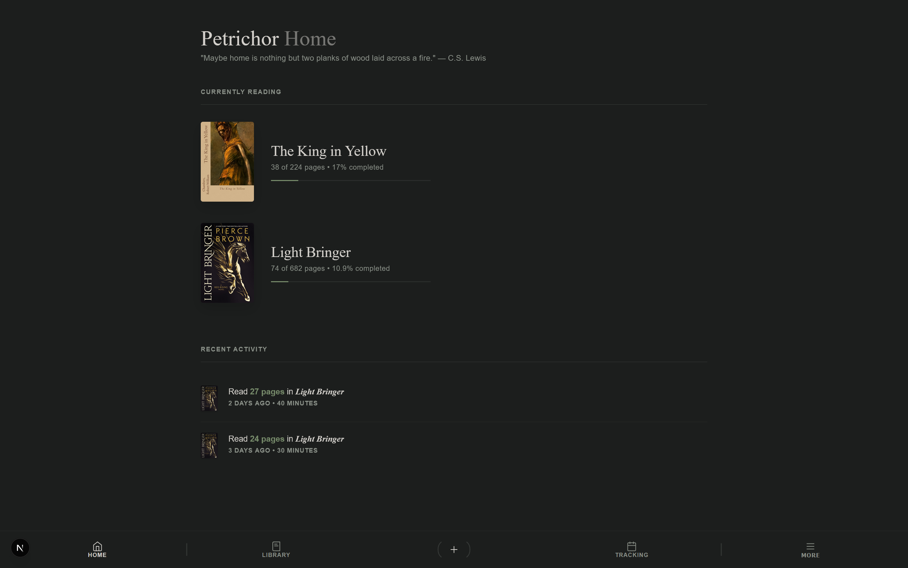
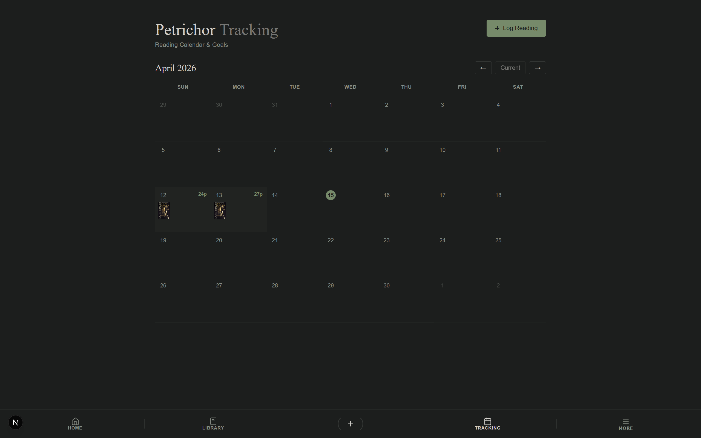
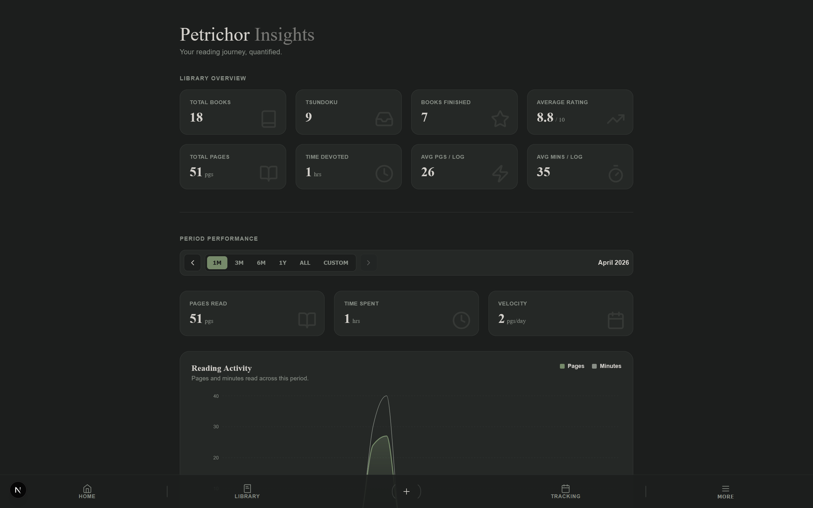
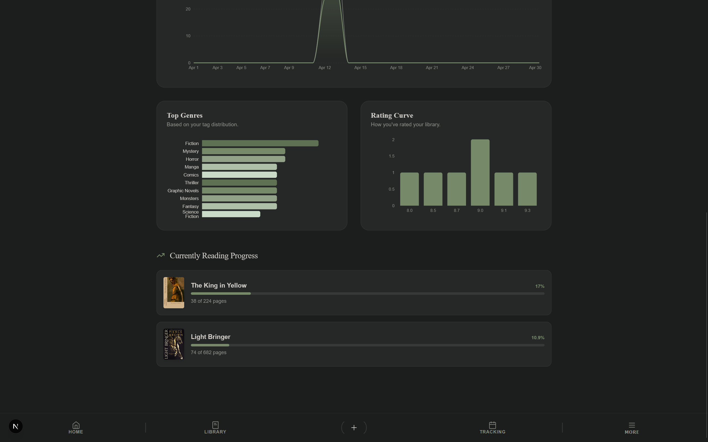
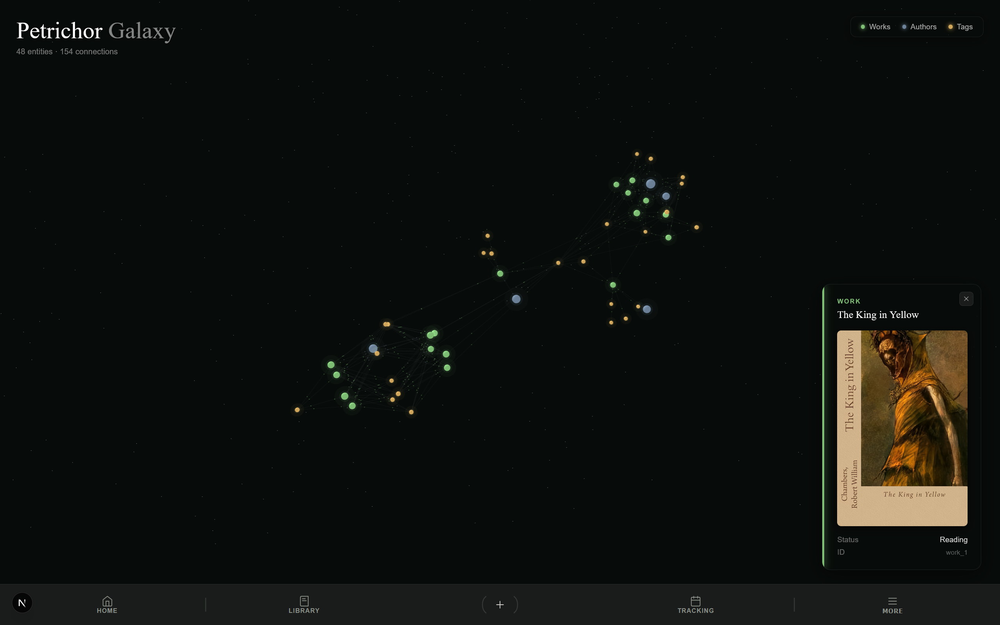
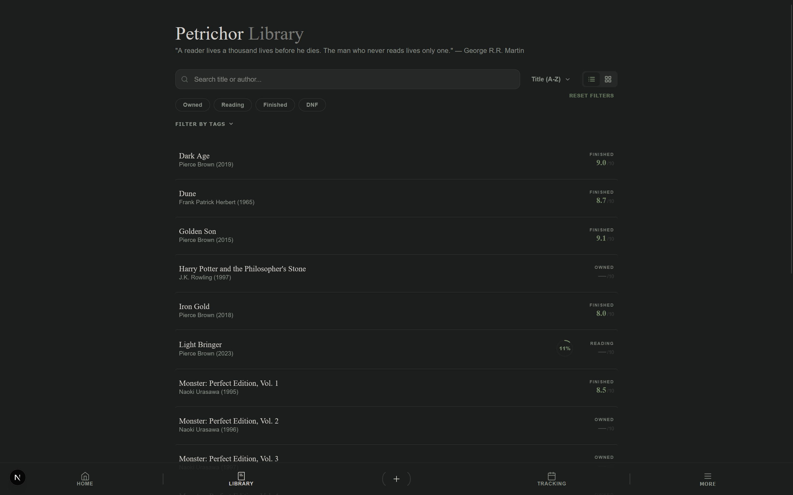
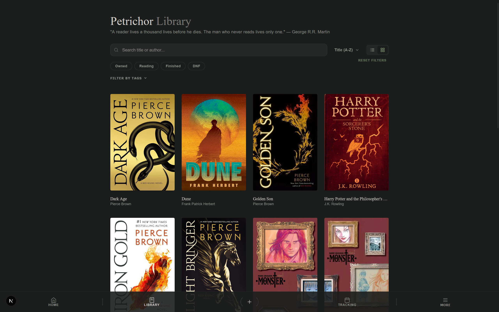

# Petrichor
The minimalist's library

Grounded in the tactile joy of cataloging, elevated by graph-based data. Petrichor is a modern, minimalist book tracking application that helps you understand your reading habits and the connections between your books.

Understand the complex simplicity of books with Petrichor.



## Features

- **Comprehensive Tracking:** Log reading sessions with page-level granularity. Track minutes read and visualize your progress over time with our calendar view.
  
  

- **Deep Insights:** Dynamic statistics and charts showing your reading frequency, genre distribution, and library composition.
  
  <div style="display: flex; gap: 10px;">
    
    
  </div>

- **Petrichor Galaxy:** An interactive 3D force-directed graph visualization of your library, mapping the relationships between works, authors, and genres in a celestial interface.
  
  

- **Personal Catalog:** Manage your library with personal ratings and reviews using minimal list and grid designs for simple and aesthetically pleasing viewing.
  
  <div style="display: flex; gap: 10px;">
    
    
  </div>

## Tech Stack

- **Frontend:** [Next.js](https://nextjs.org/) (TypeScript, Tailwind-ish CSS)
- **Backend:** [FastAPI](https://fastapi.tiangolo.com/) (Python)
- **Database:** [KùzuDB](https://kuzudb.com/) (Embedded Graph Database)
- **Visualization:** [Three.js](https://threejs.org/) & [React Force Graph](https://github.com/vasturiano/react-force-graph)
- **Deployment:** [Docker](https://www.docker.com/) & [Docker Compose](https://docs.docker.com/compose/)

## Getting Started

### Prerequisites

- [Docker](https://docs.docker.com/get-docker/)
- [Docker Compose](https://docs.docker.com/compose/install/)

### Execution

The application is containerized for easy setup. Simply run:

```bash
docker compose up --build
```

To run on custom ports:

```bash
FRONTEND_PORT={PORT} BACKEND_PORT={PORT} docker compose up -d --build
```

- **Frontend:** [http://localhost:3000](http://localhost:3000) (or your custom `FRONTEND_PORT`)
- **Backend API:** [http://localhost:8000](http://localhost:8000) (or `BACKEND_PORT`)

## Architecture

Petrichor uses a graph-based data model (following FRBR principles) to manage bibliographic records. By using **KùzuDB**, the application can efficiently traverse complex relationships between authors, works, and editions, powering the interactive "Galaxy" visualization.

- `frontend/`: React/Next.js application.
- `backend/`: FastAPI service with KùzuDB integration and Goodreads scraping logic.
- `backend/data/`: Persistent storage for the graph database.
